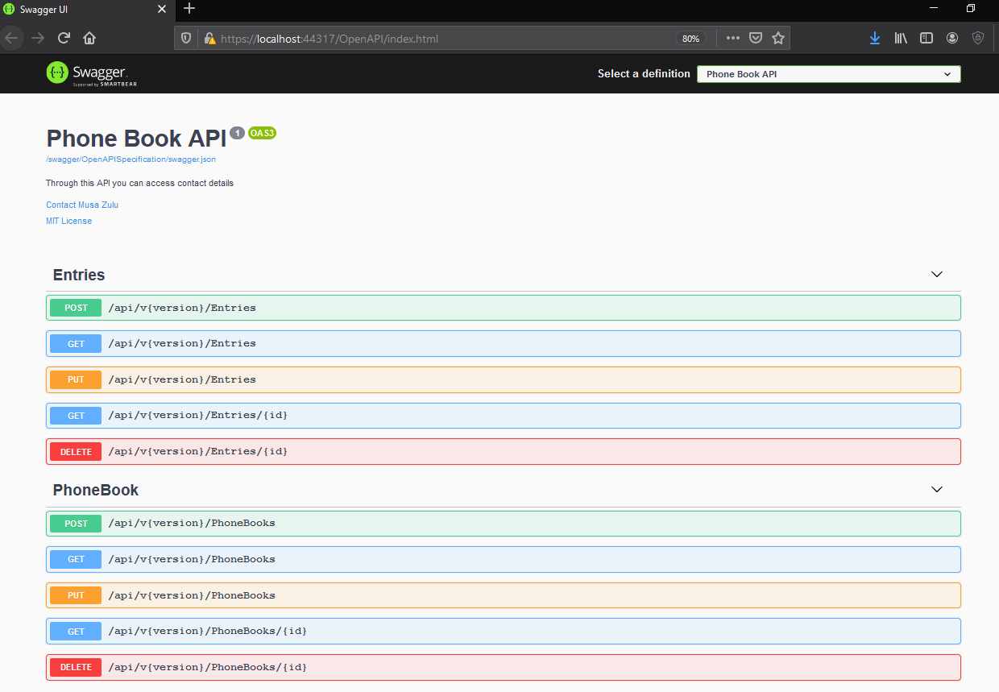

# Phone Book Onion architecture with ASP.NET Core

 

  <h3 align="center">Onion Architecture</h3>

  

    PhoneBook API solution is built on Onion Architecture with all essential feature using .NET Core!
  

<!-- TABLE OF CONTENTS -->
## Table of Contents

* [Onion Architecture](#Onion-Architecture)
  * [reference](#reference)
* [About the project](#about-the-project)
  <!-- * [Built With](#built-with) -->
* [Getting started](#getting-started)
* [Features available in this project](#features-available-in-this-project)
* [Project description](#project-description)
* [License used](#license-used)
* [Contact](#contact)
<!-- * [Acknowledgements](#acknowledgements) -->

## Onion Architecture

Onion Architecture was introduced by Jeffrey Palermo to provide a better way to build applications in perspective of better testability, maintainability, and dependability on the infrastructures like databases and services

Onion, Clean or Hexagonal architecture: it's all the same. Which is built on Domain-Driven Desgin approach.

Domain in center and building layer top of it. You can call it as Domain-centric Architecture too.

### Reference

* [It's all the same (Domain centeric architecture) - Mark Seemann](https://blog.ploeh.dk/2013/12/03/layers-onions-ports-adapters-its-all-the-same/)
* [Onion Architecture by Jeffrey Palermo](https://jeffreypalermo.com/2008/07/the-onion-architecture-part-1/)
* [Clean Architecture by Robert C. Martin (Uncle Bob)
](https://blog.cleancoder.com/uncle-bob/2012/08/13/the-clean-architecture.html)
* [Hexagonal Architecture by Dr. Alistair Cockburn](https://alistair.cockburn.us/hexagonal+architecture)

## About The Project

<!-- [![Product Name Screen Shot][product-screenshot]](https://example.com) -->

PhoneBook API solution is built on Onion Architecture with all essential feature using .NET Core.

## Getting Started

### Step 1: Clone the solution
### Step 2: Restore nuget packages and install packages for the client project
### Step 3: Create Database (Sample is for Microsoft SQL Server)

Plese run the script file "InitialScript" under documents\scripts to create your database

### Step 4: Build and run application

Swagger UI

## Features available in this project

This phone book api contains following features.

- [x] Application is implemented on Onion architecture
- [x] API
- [x] Entityframework Core
- [x] Expection handling
- [x] Automapper
- [x] Versioning
- [x] Swagger
- [x] CQRS Pattern 

## Project description

we can see that all the Layers are dependent only on the Core Layers

  
<b>Domain layer</b>

  

    Domain Layers (Core layer) is implemented in center and never depends on any other layer. Therefore, what we do is that we create interfaces to Persistence layer and these interfaces get implemented in the external layers. This is also known and DIP or Dependency Inversion Principle
  

  
<b>Persistence layer</b>

  

    In Persistence layer where we implement reposistory design pattern. In our project, we have implement Entityframework which already implements a repository design pattern. 
  

  
<b>Service layer</b>

  

    Service layer (or also called as Application layer) where we can implement business logic. For OLAP/OLTP process, we can implement CQRS design pattern. In our project, we have implemented CQRS design pattern on top of Mediator design pattern via MediatR libraries
  
 

  
<b>Presentation Layer</b>

  

    This is an angular app found under client folder.

  

## License Used
[![MIT License][license-shield]][license-url]

See the contents of the LICENSE file for details

## Contact

Having any issues or troubles getting started? Drop a mail to zuluchs@gmail.com. Always happy to help.

I do coding for fun during leisure time, but I have to pay the bills, so I also work for money :P  

[license-shield]: https://img.shields.io/badge/License-MIT-yellow.svg
[license-url]: https://opensource.org/licenses/MIT
